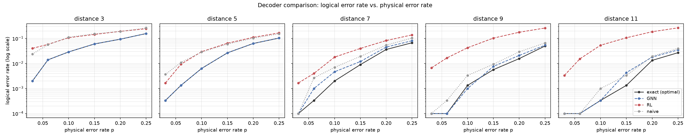
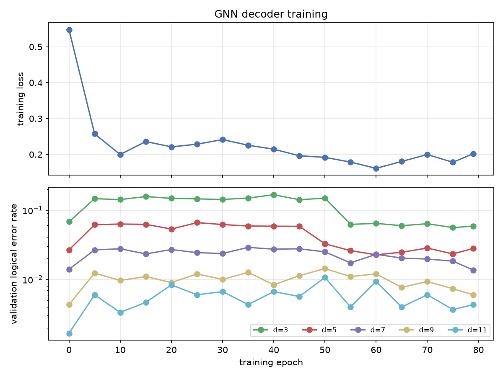
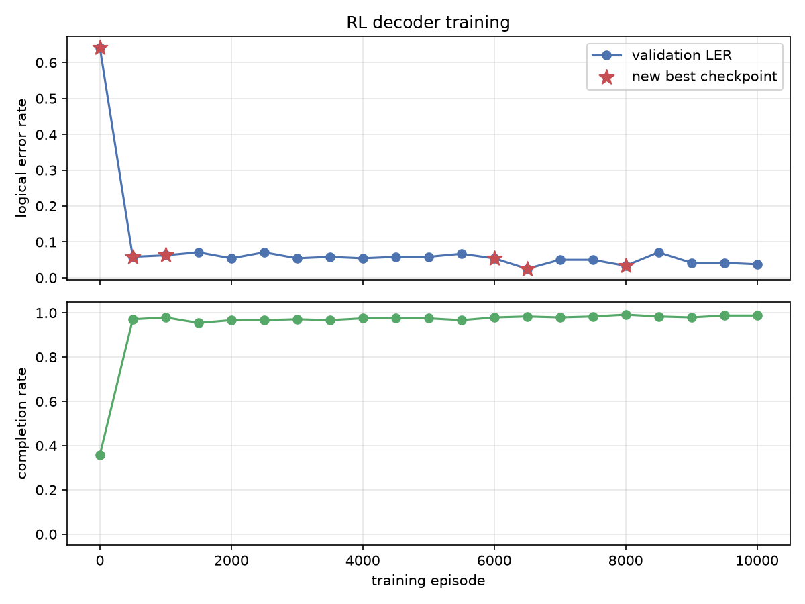

# qec-decoder-rl-gnn

Two independent learned decoders for the quantum repetition code: a graph neural network (TensorFlow) that reads the syndrome in one shot, and a reinforcement learning agent (PyTorch) that decodes it step by step, benchmarked against the exact optimal decoder and a naive baseline, with PennyLane used to verify the classical error simulator against an actual gate-level quantum circuit.

## Overview

Quantum error correction only works if you can take a noisy syndrome measurement and correctly guess which physical qubits actually flipped; get that wrong and the "correction" makes things worse, not better. This is a genuinely hard, actively-researched problem for real codes (the surface code), but it has a version simple enough to study end to end with an exact ground-truth decoder to check against: the **repetition code**, where a logical qubit is encoded across `d` physical qubits and independent bit-flip errors are inferred from `d-1` parity checks.

This project builds that pipeline twice, with two different learning paradigms:

- A **graph neural network decoder** (custom Graph Convolutional layers, written directly against TensorFlow, no external GNN library) that takes the code's Tanner graph and a syndrome, and predicts the full correction in a single forward pass. Because the same weights apply to a graph of any size, one trained model generalizes to code distances it never trained on.
- A **reinforcement learning decoder** (PyTorch, Double DQN) that decodes sequentially, picking one qubit to flip at a time and watching the residual syndrome shrink until every check is satisfied, using a feature-based Q-network, potential-based reward shaping, and best-checkpoint deployment.
- A **PennyLane gate-level circuit simulation** of syndrome extraction, used to verify that the fast classical XOR simulator both decoders actually train against is mathematically equivalent to a real quantum circuit, not just assumed to be.
- An **evaluation harness** that compares the exact optimal decoder, the GNN, the RL agent, and a naive local-majority baseline across 5 code distances and 6 physical error rates on identical error samples.

## Design choices

- **The classical shortcut is verified, not assumed.** `src/repetition_code.py` simulates errors and syndromes with plain XOR arithmetic instead of a quantum circuit, which is mathematically exact for this code (X errors and Z-basis parity checks are both diagonal in the computational basis) but would silently stop being exact for a code needing to correct both X and Z errors, like the surface code. `src/pennylane_sim.py` builds the actual gate-level circuit (X-gate errors, CNOT-based parity extraction, `qml.sample` readout) and `tests/test_pennylane_sim.py` checks the two agree on every single-qubit-flip pattern plus random multi-qubit ones.
- **A real TensorFlow/PyTorch conflict, solved architecturally.** Building the combined evaluation harness for this project hit a real, reproducible crash: constructing a `torch.nn.Module` in the same process after TensorFlow has been imported segfaults (SIGSEGV) in this environment. No amount of `OMP_NUM_THREADS=1` / `KMP_DUPLICATE_LIB_OK` environment-variable tweaking fixed the underlying native-library conflict. The fix is architectural rather than a workaround: `src/eval_config.py` holds the shared evaluation grid and a `cell_seed(distance, p)` function with **zero** ML-framework imports; `src/evaluate_gnn.py` (TensorFlow) and `src/evaluate_rl.py` (PyTorch) each depend only on that, never on each other; `src/evaluate.py` runs them as two separate `subprocess.run()` calls and merges their JSON output; `src/cli.py` uses lazy, function-local imports so no single invocation ever loads both frameworks; and the test suite is physically split into `tests/gnn/` (TensorFlow) and `tests/rl/` (PyTorch), run as two separate `pytest` invocations (see "Run the tests" below). Both subprocesses derive their per-cell RNG seed from `cell_seed(distance, p)` alone, so despite never sharing memory they evaluate on byte-identical error samples, making the merged comparison an apples-to-apples one.
- **Feature-based Q-network, not a fixed output layer.** The RL agent's Q-network scores a 6-dimensional feature vector per *candidate qubit* (active-neighbour-check count, degree, net syndrome-weight delta, whether already flipped this episode, overall syndrome density, distance to nearest active check) rather than indexing a fixed-size output layer, so one trained model works on any code distance's action count. See `src/rl_features.py`.
- **The anti-cycling fix.** An early version of the RL environment allowed re-flipping any qubit, including ones already flipped this episode. Under-trained greedy rollouts on out-of-distribution syndromes got stuck in a deterministic flip/unflip 2-cycle and never terminated, confirmed by directly inspecting the Q-network's argmax across the cycled states, which was identical step after step even at epsilon=0.2. The fix, `DecodingEnv.candidate_actions()` excluding already-flipped qubits, is mathematically justified: only two complementary bitstrings can ever fully clear a given syndrome (see `repetition_code.exact_map_decoder`'s docstring), so no valid minimum-weight correction ever needs to flip the same qubit twice. This guarantees every episode terminates within at most `n_data` steps. See `tests/test_rl_env.py::test_episode_always_terminates_within_n_data_steps_even_with_worst_policy`.
- **Potential-based reward shaping + Double DQN.** The raw reward (-1 per flip, plus a terminal bonus/penalty for the decoded logical bit) is sparse enough to destabilize training on its own. Two fixes address this: potential-based shaping (Ng, Harada & Russell 1999) using negative residual-syndrome weight as the potential, and Double DQN (select the next action with the online network, evaluate it with the target network) to avoid Q-value overestimation. See `src/rl_env.py::DecodingEnv.potential()` and `src/dqn_agent.py::DQNAgent.train_step()`.
- **Best-checkpoint deployment.** DQN training here is not monotonic, as `data/reports/rl_training_curve.png` shows. `train_rl.py` evaluates on a fixed validation set (distances 5/7/9/11) every 200 episodes and deploys whichever checkpoint scored best on `(completion_rate, -logical_error_rate, -mean_flips)`, not necessarily the final episode's weights.
- **A GCN written from scratch, not imported.** `src/gnn_decoder.py`'s `GraphConvLayer` implements the Kipf & Welling (2017) propagation rule (`H' = activation(D^-1/2 (A+I) D^-1/2 @ H @ W + b)`) directly against TensorFlow tensor ops in about ten lines, rather than pulling in a dedicated GNN library, keeping the message-passing step fully transparent and dependency-free.
- **Explicit extrapolation marking.** `evaluate_gnn.py` trains only on distances (3, 5, 7); `evaluate_rl.py` trains only on distances (5, 7, 9, 11). Both are evaluated on all five distances, and every row in `decoder_eval.md` where a decoder is extrapolating to a distance it never trained on is marked with a `*`.
- **Two summary tables.** An early version of `evaluate.py`'s report summarized results as a single ratio (decoder LER / optimal LER) averaged across all cells, which produces misleading numbers like "20x worse" on cells where both the optimal and the learned decoder's logical error rate are already near zero (0.0003 vs 0.0000 is a 100%+ "ratio" for two essentially-perfect results). The report now filters the ratio table to cells with non-negligible optimal LER (>= 0.005) where the comparison is meaningful, and separately reports plain mean absolute logical error rate across every cell, unfiltered, as the primary headline number.

## Architecture

```
src/repetition_code.py  (exact classical simulator: errors, syndromes, optimal decoder)
src/tanner_graph.py     (bipartite graph structure, GCN-normalized adjacency)
src/pennylane_sim.py    (gate-level circuit cross-check, verifies the classical shortcut)
                                    |
                +-------------------+-------------------+
                |                                        |
                v                                        v
   src/gnn_decoder.py + src/train_gnn.py       src/rl_env.py + src/rl_features.py
   (TensorFlow: supervised GCN, one-shot         + src/dqn_agent.py + src/train_rl.py
    correction from syndrome)                    (PyTorch: sequential Double DQN,
                |                                  one flip at a time)
                v                                        v
   data/processed/gnn_decoder.weights.h5      data/processed/dqn_decoder.pt
                |                                        |
                v                                        v
      src/evaluate_gnn.py (TF-only process)    src/evaluate_rl.py (PyTorch-only process)
                |                                        |
                +-------------------+-------------------+
                                    |
                    src/evaluate.py (orchestrator: runs both as
                       subprocesses, merges on shared cell_seed)
                                    |
                                    v
                data/reports/decoder_eval.md/.json + comparison plot
```

## Features

- An exact, closed-form maximum-likelihood decoder for the repetition code (`exact_map_decoder`), verified against brute-force search over all error patterns for d = 7: the ground truth every learned decoder is measured against
- A gate-level PennyLane circuit that independently verifies the classical error/syndrome simulator against real quantum-circuit simulation
- A from-scratch Graph Convolutional Network decoder (TensorFlow/Keras) trained by supervised learning, generalizing across code distances from one set of weights
- A sequential Double DQN decoding agent (PyTorch) with potential-based reward shaping, feature-based action scoring, an anti-cycling environment fix, and best-validation-checkpoint deployment
- A naive local-majority baseline decoder as a lower bound for both learned decoders
- An evaluation harness comparing all four decoders on identical error samples across 5 code distances x 6 physical error rates (30 cells, 3,000 shots each), explicitly marking which cells are out-of-distribution extrapolation for each learned decoder
- Subprocess isolation, shared-seed reconciliation, and split test suites to work around a real TensorFlow/PyTorch process-level conflict
- 30 automated tests (pytest): 20 framework-agnostic (pure numpy) covering the classical decoder, the PennyLane cross-check, and the RL environment; 4 TensorFlow-only covering the GNN decoder; 6 PyTorch-only covering the DQN agent, including a targeted regression test for the Double DQN fix

## Dataset

Every error sample, syndrome, and training/evaluation shot is generated by this repo's own code; there is no downloaded dataset. Full details on the code family, the training/evaluation seeding scheme, and the held-out generalization split (which distances each decoder does and doesn't train on) are in [`dataset_card.md`](dataset_card.md).

## Project Structure

```
qec-decoder-rl-gnn/
├── data/
│   ├── processed/
│   │   ├── gnn_decoder.weights.h5      # trained GNN weights
│   │   ├── dqn_decoder.pt              # trained RL agent (best validation checkpoint)
│   │   ├── gnn_training_log.json       # GNN training/validation history
│   │   ├── rl_training_log.json        # RL training/validation history
│   │   ├── eval_gnn_results.json       # exact + GNN + naive eval (TF subprocess output)
│   │   └── eval_rl_results.json        # RL eval (PyTorch subprocess output)
│   └── reports/
│       ├── decoder_eval.md / .json     # merged 4-decoder comparison report
│       ├── gnn_training_curve.png
│       ├── rl_training_curve.png
│       └── decoder_comparison.png      # LER vs. p, one panel per distance
├── src/
│   ├── repetition_code.py              # exact classical simulator + optimal decoder
│   ├── tanner_graph.py                 # bipartite graph + GCN-normalized adjacency
│   ├── pennylane_sim.py                # gate-level circuit cross-check
│   ├── gnn_decoder.py                  # TensorFlow/Keras GCN decoder
│   ├── train_gnn.py                    # GNN supervised training loop
│   ├── rl_env.py                       # sequential decoding environment
│   ├── rl_features.py                  # per-candidate-qubit feature engineering
│   ├── dqn_agent.py                    # PyTorch Double DQN agent
│   ├── train_rl.py                     # RL training loop w/ reward shaping, best-checkpoint saving
│   ├── naive_baseline.py               # local-majority baseline decoder
│   ├── eval_config.py                  # shared eval grid + deterministic seeding (NO framework imports)
│   ├── evaluate_gnn.py                 # exact + GNN + naive eval (run as its own process)
│   ├── evaluate_rl.py                  # RL eval (run as its own process)
│   ├── evaluate.py                     # orchestrator: runs both as subprocesses, merges + reports
│   ├── plot_results.py                 # training curves + decoder comparison plot
│   └── cli.py                          # unified command-line entry point (lazy imports)
├── tests/
│   ├── test_repetition_code.py         # framework-agnostic
│   ├── test_pennylane_sim.py           # framework-agnostic
│   ├── test_rl_env.py                  # framework-agnostic
│   ├── gnn/test_gnn_decoder.py         # TensorFlow-only
│   └── rl/test_dqn_agent.py            # PyTorch-only
├── dataset_card.md
├── requirements.txt
├── .env.example
├── .gitignore
└── README.md
```

## Setup

You need Python 3.10+.

```bash
python3 -m venv .venv
source .venv/bin/activate
pip install -r requirements.txt
```

## Run the Pipeline

```bash
# 1. Train the GNN decoder (~2 minutes on CPU, TensorFlow)
python -m src.cli train-gnn --epochs 80

# 2. Train the RL decoder (~4-5 minutes on CPU, PyTorch)
python -m src.cli train-rl --episodes 10000

# 3. Evaluate all 4 decoders (runs the GNN and RL halves as separate
#    subprocesses internally; see "Design choices" above for why)
python -m src.cli evaluate

# 4. Plot both training curves + the decoder comparison
python -m src.cli plot

# Or steps 1-4 together:
python -m src.cli all --epochs 80 --episodes 10000
```

`train-gnn`, `train-rl`, `evaluate`, and `plot` are each safe to run as a single `python -m src.cli ...` invocation: `cli.py` uses lazy, function-local imports specifically so that no single command ever loads both TensorFlow and PyTorch into one process. `all` is safe too, since it calls each step as its own function call within the same lazy-import discipline (`evaluate`'s own internals still fork into subprocesses for its TF/PyTorch halves).

### Run the tests

Because TensorFlow and PyTorch cannot coexist in one process here, **the test suite must be run as two separate `pytest` invocations**, not one combined `pytest -q`:

```bash
# Framework-agnostic + TensorFlow-only tests (safe together)
pytest tests/test_repetition_code.py tests/test_pennylane_sim.py tests/test_rl_env.py tests/gnn/ -v

# PyTorch-only tests, in their own process
pytest tests/rl/ -v
```

(Splitting the framework-agnostic tests into the TensorFlow run vs. the PyTorch run is an arbitrary choice for convenience; they don't depend on either framework. What matters is that `tests/gnn/` and `tests/rl/` never run in the same `pytest` process.)

## Outputs

```
data/processed/gnn_decoder.weights.h5      # trained GNN weights
data/processed/dqn_decoder.pt              # trained RL agent (best validation checkpoint)
data/processed/gnn_training_log.json       # GNN training/validation history
data/processed/rl_training_log.json        # RL training/validation history
data/reports/decoder_eval.md / .json       # merged 4-decoder comparison report
data/reports/gnn_training_curve.png        # GNN training loss + per-distance validation LER
data/reports/rl_training_curve.png         # RL validation LER + completion rate vs. episode
data/reports/decoder_comparison.png        # LER vs. physical error rate, one panel per distance
```

## Results

**GNN training:** 80 epochs (~2 minutes on CPU), training loss dropped from 0.547 to 0.202. Trained only on distances (3, 5, 7); on those distances the GNN's logical error rate is essentially identical to the exact optimal decoder on the same shots.

**RL training:** 10,000 episodes (~4.5 minutes on CPU). The final best-validation checkpoint reaches 98.75% completion rate and a 3.75% logical error rate on a fixed validation set (distances 5/7/9/11 at p=0.12), up from a near-random starting policy.

Full 4-decoder comparison, 5 distances x 6 physical error rates x 3,000 shots each, identical error samples across all four decoders (`*` = extrapolating to a distance that decoder never trained on):

| Decoder | Mean absolute LER (all 30 cells) | Mean ratio to optimal, trained distances | Mean ratio to optimal, extrapolated distances |
|---|---|---|---|
| exact (optimal) | 0.0262 | 1.00 | n/a |
| **GNN** | **0.0281** | **1.07** | 1.28 |
| naive (local majority) | 0.0506 | 2.17 | n/a |
| RL | 0.0899 | 6.49 | 2.77 |

(Ratio columns restricted to the 17/30 cells where the optimal decoder's LER is >= 0.005; see "Design choices" for why. The mean-absolute-LER column uses all 30 cells and isn't sensitive to that issue.)



**Interpretation:** the GNN decoder is close to optimal, including on distance 3 and 5 (identical LER to the exact decoder in several cells) and reasonably close even extrapolating to distances 9 and 11 it never trained on. The RL decoder is a working, correctly-verified decoder, markedly better than random and structurally sound (100% episode termination via the anti-cycling fix, ~99% completion at evaluation time), but it lands behind the naive local-majority baseline on average, weakest on distance 3. Sequential one-qubit-at-a-time decision-making with only local graph features is a harder learning problem than one-shot supervised prediction from the full syndrome, and the RL agent as configured here does not close that gap.





## What's next

- Extend the GNN and RL environment to the surface code, where the PennyLane cross-check stops being a formality: X and Z errors interact there, the classical XOR shortcut no longer applies, and gate-level circuit simulation becomes load-bearing rather than a verification-only tool
- Try a recurrent or attention-based RL policy that can look at more than local graph features per step, to see whether that closes the gap to the naive baseline the current feature-based agent doesn't
- Add circuit-level (not just measurement-level) noise, i.e. errors on the CNOT gates used for syndrome extraction itself and not just on the data qubits, which is a substantially harder and more realistic decoding problem
- Compare against a real minimum-weight perfect-matching decoder (e.g. PyMatching) as a stronger classical baseline than the naive local-majority one used here
- Investigate whether the RL agent's distance-3 underperformance is a training-data-distribution issue (training only samples distances 5/7/9/11) or a more fundamental limitation of the sequential local-feature approach at small code sizes

## Disclaimer

This project is for educational and research purposes. It is a research prototype comparing a GNN-based and an RL-based approach to repetition-code decoding against a known-optimal baseline, not a production QEC decoder or a claim that either approach is ready for a real device.
